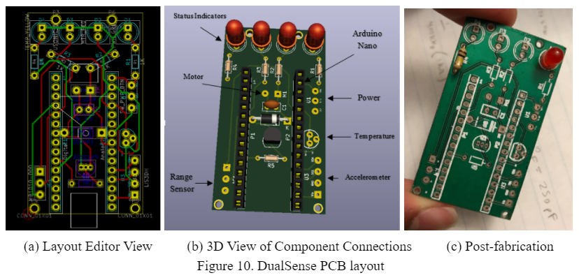
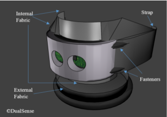

# DualSense

### Introduction

The objective of this project is to provide an alternative navigation solution for visually-impaired people. The system detects objects using proximity sensors and provides feedback through vibrations so that users can safely navigate in the presence of obstacles. Different feedback schemes are used to distinguish obstacles by proximity. 

Group (2019.047): Haseeb Syed, Ahsan Shahid, Jerry Zhang, Zain Jafri
